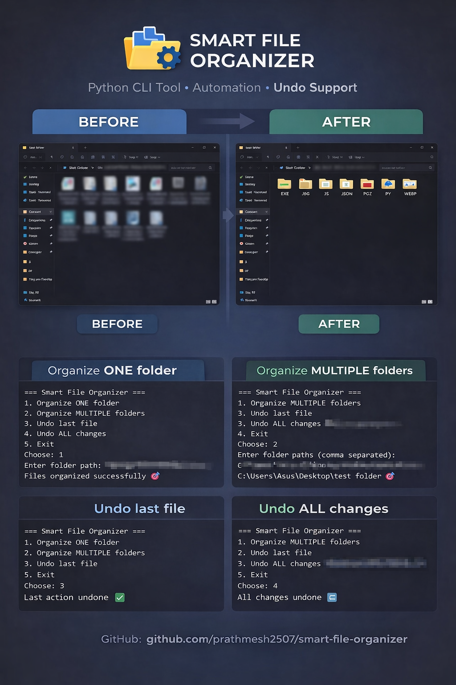

# 🚀 Smart File Organizer (CLI)

A practical **CLI-based automation tool** built using **Python**, focused on clean architecture, usability, and real-world filesystem automation.

This project demonstrates how to safely organize files while maintaining full control through undo operations.

---

## 📌 Project Overview

**Smart File Organizer** solves the common problem of messy directories filled with mixed file types by automatically organizing files into structured folders based on predefined rules such as **file type, date, or size**.

The tool is designed to be:

- ✅ **Safe** — supports undo and history tracking  
- ✅ **Flexible** — works with single or multiple folders  
- ✅ **Production-oriented** — clean structure, reusable logic, extensible design  

It can be used as a **standalone CLI utility** or extended further for desktop automation workflows.

This project is part of my **ongoing project sprint**, where I consistently build and publish real-world software to strengthen core engineering skills.

---

## 🎯 Key Features

- 📂 Organize files by **file type / extension**
- 📁 Support for **single folder** and **multiple folders**
- 🔁 Undo **last file action**
- ♻️ Undo **ALL changes** (restore original state)
- 🧹 Automatic **cleanup of empty folders**
- 🖥️ Interactive **loop-based CLI menu**
- 🛡️ Safe filesystem operations with **history tracking**

---

## 🛠️ Tech Stack

- **Language:** Python
- **Libraries Used:**
  - `os`
  - `shutil`
  - `pathlib`
  - `json`
  - `datetime`
- **Tools:** Git, VS Code

---

## 📂 Project Structure

```text
smart-file-organizer/
│
├── organizer.py        # Main CLI logic & menu handling
├── rules.py            # File sorting rules
├── undo_manager.py     # Undo system & cleanup logic
├── config.json         # Default configuration
├── history.json        # Action history for undo operations
├── README.md
└── assets/             # Screenshots 
```
---

## ⚙️ How to Run Locally
- 1️⃣ Clone the repository
    - git clone https://github.com/prathmesh2507/smart-file-organizer.git
    - cd smart-file-organizer
- 2️⃣ Run the project
    -python organizer.py

---

## 📸 Screenshots


---

## 🧠 Learnings & Takeaways
- Improved understanding of filesystem automation
- Hands-on experience with safe undo systems
- Learned how to design clean CLI workflows
- Practiced separation of concerns (logic vs input handling)
- Built a reusable and extensible automation tool

---

## 🤝 Contributing
- Suggestions and improvements are always welcome 🙌
- Feel free to fork the repository or open an issue for enhancements or bug fixes.

---

## 📫 Connect With Me
- 💻 **GitHub**: https://github.com/prathmesh2507
- 💻 **Linkedin**: https://linkedin.com/in/prathmesh-bhoyar-24b0b0310

---

## ⭐ Support
- If you found this project useful, consider giving it a star ⭐ —it really helps and motivates me to keep building!
